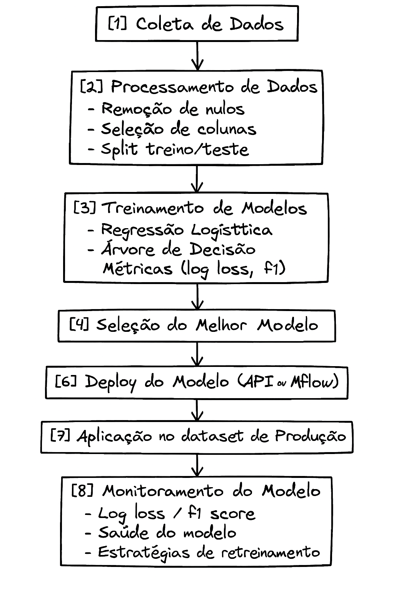

# kobe-bryant-shot-prediction
Projeto final da disciplina Engenharia de Machine Learning - INFNET. Neste repositório desenvolvemos um modelo preditivo para arremessos de Kobe Bryant utilizando técnicas de classificação, MLOps com MLflow, PyCaret e Streamlit, seguindo o framework TDSP da Microsoft.


Modelo preditivo para acertos de arremessos do Kobe Bryant com MLflow, PyCaret e Streamlit. Projeto final - Engenharia de ML | INFNET.
# Projeto Kobe Bryant Shot Prediction

## 📌 Descrição Geral

Este repositório contém o desenvolvimento do projeto final da disciplina **Engenharia de Machine Learning** do Instituto INFNET. O objetivo principal é aplicar conceitos de MLOps, AutoML, visualização de dados e estruturação de pipelines utilizando o framework **TDSP (Team Data Science Process)** da Microsoft.

## Objetivo

Prever se Kobe Bryant acertou ou errou um arremesso durante sua carreira na NBA com base em dados históricos, utilizando abordagens de **classificação e regressão** com bibliotecas como **PyCaret**, **Scikit-learn**, **MLflow** e **Streamlit**.

## Dados

Os dados utilizados neste projeto foram fornecidos pela disciplina e estão disponíveis neste link:  
[https://www.kaggle.com/c/kobe-bryant-shot-selection/data](https://www.kaggle.com/c/kobe-bryant-shot-selection/data)

Os arquivos devem ser salvos na seguinte estrutura dentro do repositório:

/data/raw/dataset_kobe_dev.parquet
/data/raw/dataset_kobe_prod.parquet


## Instruções Iniciais de Uso

1. Clone este repositório:
   ```bash
   git clone https://github.com/seu-usuario/kobe-bryant-shot-prediction.git
   cd kobe-bryant-shot-prediction

python -m venv venv
source venv/bin/activate  # ou venv\Scripts\activate no Windows

pip install -r requirements.txt

## Diagrama do Pipeline de Machine Learning

Abaixo está o fluxo completo do projeto:



## Papel das Ferramentas no Pipeline de Machine Learning

### 1. Rastreamento de Experimentos
- **MLflow** é essencial para acompanhar o histórico de execuções, registrando parâmetros, métricas, modelos e artefatos. Ele permite comparar experimentos e manter rastreabilidade.
- **PyCaret**, integrado com MLflow, registra automaticamente cada execução de modelo e seus resultados com mínimo esforço de configuração.

### 2. Funções de Treinamento
- **Scikit-learn** fornece os algoritmos principais utilizados no projeto, como Regressão Logística e Árvore de Decisão.
- **PyCaret** automatiza grande parte do pipeline de modelagem: limpeza, seleção de atributos, validação cruzada, tuning de hiperparâmetros e comparação entre modelos.

### 3. Monitoramento da Saúde do Modelo
- **MLflow** permite registrar métricas como `log loss` e `f1_score`, que ajudam a acompanhar a performance do modelo ao longo do tempo.
- A partir dessas métricas, é possível identificar degradação do modelo e tomar ações corretivas.
- Em conjunto com **Streamlit**, é possível construir dashboards para visualização em tempo real dessas métricas.

### 4. Atualização do Modelo
- Através de pipelines versionados e reusáveis, **MLflow** permite a atualização contínua dos modelos com novos dados.
- **PyCaret** facilita o re-treinamento do modelo com os mesmos passos aplicados anteriormente, garantindo consistência.
  
### 5. Provisionamento (Deployment)
- **MLflow** disponibiliza APIs REST com o comando `mlflow models serve`, facilitando a publicação dos modelos em ambientes locais ou em nuvem.
- **Streamlit** permite desenvolver interfaces simples e eficientes para testar o modelo em tempo real, com inputs de usuários e visualização dos resultados.

---

##  Artefatos do Projeto

Durante o desenvolvimento deste projeto, os seguintes artefatos serão criados e armazenados conforme a estrutura TDSP:

###  `/data/raw/`
- **dataset_kobe_dev.parquet**  
  Conjunto de dados com as informações históricas de arremessos de Kobe Bryant, usado para desenvolvimento e treinamento do modelo.

- **dataset_kobe_prod.parquet**  
  Conjunto de dados simulado para produção, usado para aplicar o modelo final treinado.

---

### `/data/processed/`
- **data_filtered.parquet**  
  Base resultante após tratamento de dados: seleção de colunas relevantes e remoção de valores ausentes.

- **base_train.parquet**  
  Subconjunto com 80% dos dados, estratificado, usado para treinamento do modelo.

- **base_test.parquet**  
  Subconjunto com 20% dos dados, estratificado, usado para validação do modelo.

- **resultados_aplicacao.parquet**  
  Resultados das previsões do modelo aplicadas sobre a base de produção, contendo as métricas de avaliação.

---

### `/code/`
- **data_prep/preparacao_dados.py**  
  Script responsável por realizar o tratamento dos dados brutos, gerar os arquivos processados e registrar essa etapa no MLflow com a run “PreparacaoDados”.

- **training/treinamento_modelos.py**  
  Script que realiza o treinamento dos modelos (Regressão Logística e Árvore de Decisão) com PyCaret, registra as métricas e salva o melhor modelo.

- **inference/aplicacao.py**  
  Script que carrega a base de produção, aplica o modelo salvo e registra a execução com a run “PipelineAplicacao” no MLflow.

---

### `/outputs/`
- **mlruns/**  
  Diretório gerado pelo MLflow com todos os logs de execuções, métricas, parâmetros e modelos treinados.

---

### `/docs/`
- **diagrama_pipeline.png**  
  Representação gráfica do fluxo de trabalho do projeto, desde a coleta de dados até a operacionalização do modelo.

---

### Arquivos adicionais
- **requirements.txt**  
  Lista com todas as dependências necessárias para rodar o projeto.

- **README.md**  
  Documentação completa do projeto, contendo descrição, objetivos, instruções de uso, artefatos e respostas conceituais.

---
1. Qual a dimensão resultante do dataset após limpeza?
Dimensão final do dataset: (20285, 7)
São 20.285 registros válidos com 7 colunas
---
2. Como a escolha de treino/teste afeta o modelo?
A escolha impacta diretamente na generalização do modelo. Usar uma divisão aleatória e estratificada garante representatividade das classes, evita viés e melhora a avaliação real do desempenho.
---
3. Estratégias para minimizar viés de dados?
- Divisão estratificada
- Validação cruzada (k-fold)
- Acompanhamento contínuo da performance em produção
- Balanceamento de classes (se necessário)